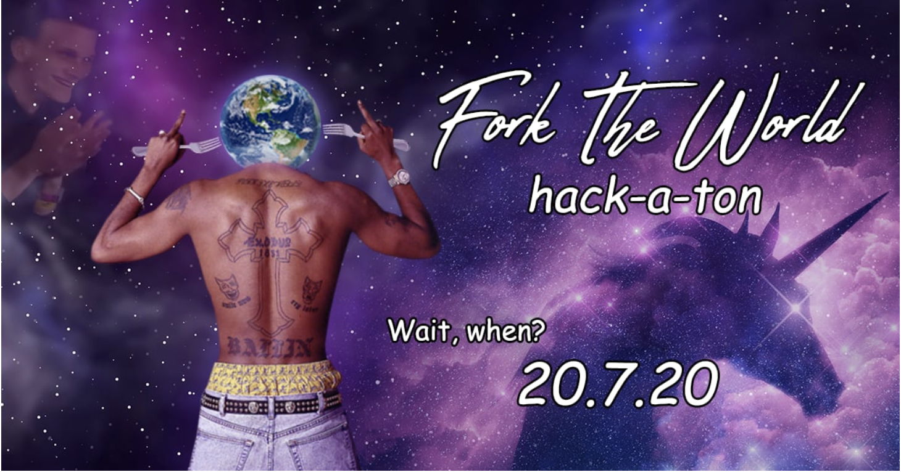

<!--  -->

# **Distributed Autonomous Organizations**

On coordinating individuals for the greater good

---

## State of the world

- Natural resoures are being depleted and abused
- The social dimension of the internet is a dumpster fire
- Banks are too big to fail
- Governments are not responsive to the people they govern

---

Elinor Ostrom

Nobel Prize in Economics 2009

[**Design principles for Common Pool Resource (CPR) institution**](https://en.wikipedia.org/wiki/Elinor_Ostrom)

---

1. We can manage the commons effectively with the correct **institutions**
2. The commons are literally everywhere
(2.5 many goods we consider private can be common see [Radical Markets](http://radicalmarkets.com/))

**How do we scale the management of the commons past [Dunbar's Number](https://en.wikipedia.org/wiki/Dunbar's_number)**

---

[Vitalik DAO](https://blog.ethereum.org/2014/05/06/daos-dacs-das-and-more-an-incomplete-terminology-guide/)

---

## High level design

- coordinate interactions with smart contracts
- pool money together to achieve common goal
- funds are allocated based on some voting or consensus protocol

---

Create in 2016 and attracted ~150 million in funding

Hacked and drained of $50 million

Forced a hard fork in Ethereum

---

---

---

DAO platforms/SDKs?

- voting: qaudratic, dot, conviction
- dispute resolution via courts
- fund management
- rage quit (moloch)

---

 Token Engineering

---

---

---

---

[Virtual Worlds](https://www.cryptovoxels.com/play?coords=NW@357E,105S.)

---

---

[Aragon DAO Hackathon July 6th-19th](https://hackforfreedom.org/)

---

---

## Thank you and remember...

## ...coordinate or die

Further Reading

[https://hackernoon.com/reboot-a-new-operating-system-for-humanity-up303y8w!](https://hackernoon.com/reboot-a-new-operating-system-for-humanity-up303y8w)

[http://radicalmarkets.com/](http://radicalmarkets.com/)

[metacartel](https://medium.com/metacartel)

[Commons Stack](https://commonsstack.org/)